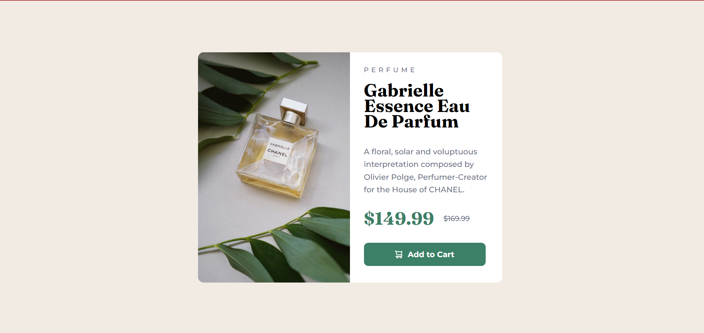

# Frontend Mentor - Product preview card component solution

This is a solution to the [Product preview card component challenge on Frontend Mentor](https://www.frontendmentor.io/challenges/product-preview-card-component-GO7UmttRfa). Frontend Mentor challenges help you improve your coding skills by building realistic projects. 

## Table of contents

- [Overview](#overview)
  - [The challenge](#the-challenge)
  - [Screenshot](#screenshot)
  - [Links](#links)
- [My process](#my-process)
  - [Built with](#built-with)
  - [Continued development](#continued-development)
  - [Useful resources](#useful-resources)
- [Author](#author)

**Note: Delete this note and update the table of contents based on what sections you keep.**

## Overview
 Esse projeto de um card de um produto responsivel

### The challenge

Os usuários devem ser capazes de:

- Veja o layout ideal dependendo do tamanho da tela do dispositivo
- Veja os estados de foco e foco para elementos interativos

### Screenshot

### Links

- Solution URL: [Add solution URL here](https://your-solution-url.com)
- Live Site URL: [Add live site URL here](https://yuri151.github.io/product-preview-card-component-main/)

## My process
 Começei pela parte desktop adicionando os elemanto HTML e assim que eu terminei partir para o CSS 
 estilizando de baixo para cima
### Built with

- Semantic HTML5 markup
- CSS custom properties
- Flexbox
- Media Query

### Continued development

 HTML semantic 
 Flexbox 
 responsividade 

### Useful resources

- [line-height:](https://www.w3schools.com/cssref/pr_dim_line-height.php) - This helped me for XYZ reason. I really liked this pattern and will use it going forward.

## Author

- GitHub- [Yuri](https://github.com/yuri151)
- Frontend Mentor - [@yuri151](https://www.frontendmentor.io/profile/yuri151)
